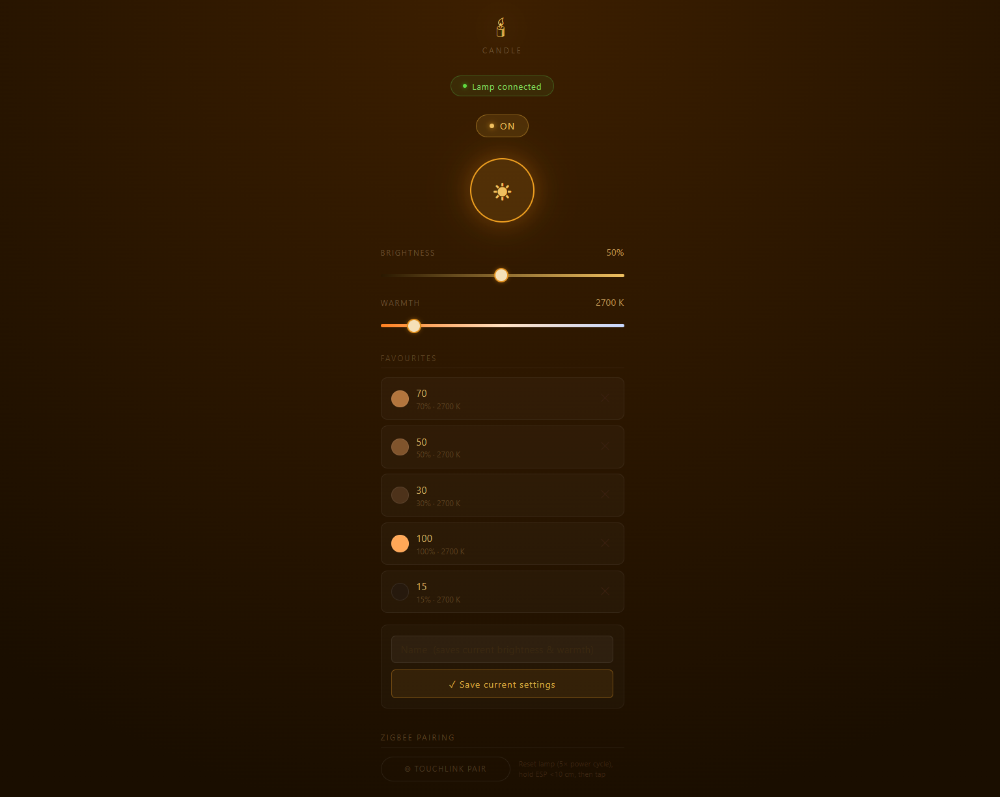

# ESP32 Hue Candle Controller

Control your Philips Hue candle lamp directly with a ESP32-C5 as Zigbee coordinator — no Bluetooth Hue Bridge required.

## Features
- Zigbee Touchlink pairing
- On/Off, brightness, color temperature control (2200K–6500K) via ZCL
- Local web interface
- WiFi + HTTP server with web UI
- Favorite settings with NVS persistence
- Android home screen shortcuts via:
    http://<ESP_IP>/cmd?on
    http://<ESP_IP>/cmd?off
    http://<ESP_IP>/cmd?fav=0

## Web Interface

## Hardware
- ESP32-C5 development board
- Philips Hue White Ambiance Candle E14
- Optional 3 buttons: GPIO4=Pair, GPIO5=On, GPIO6=Off (active-low)

## Setup
1. Edit WIFI_SSID and WIFI_PASSWORD in main/esp_zb_switch.c
2. idf.py set-target esp32c5
3. idf.py build
4. idf.py -p COMX erase-flash
5. idf.py -p COMX flash monitor

## Pairing
Factory-reset the lamp (Using Hue App or 5x power cycle until it flashes),
hold ESP within 10cm, press TOUCHLINK PAIR in web interface or press GPIO4.

## Requirements
- ESP-IDF v5.5